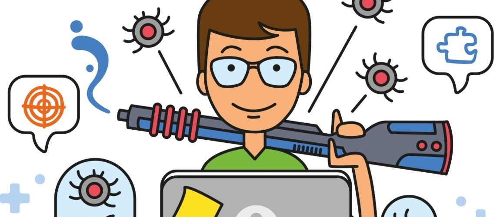

<code></code>
## Hi there 👋

<!--About me-->
## :technologist:Обо мне:

- Меня зовут Алексей
- Я работаю Manual QA Engineer
- В настоящий момент изучаю автоматизированное тестирование на Python
- Мой телеграмм:
 

  &#8287;&#8287;&#8287;&#8287;&#8287;
  
  &#8287;

<!--Education-->

## :man_student:Образование:
<table width="80%" border='0'>
   <tr> 
    <tr><td width="10%" valign="bottom"></td><td valign="middle">Stepik "Поколение Python": курс для начинающих <a target="_blank" href="https://stepik.org/cert/1733231">Сертификат</a>.</td></tr>
    <tr><td width="10%" valign="bottom"></td><td valign="middle">Stepik "Поколение Python": курс для профессионалов <a target="_blank" href="https://stepik.org/cert/2281078">Сертификат</a>.</td></tr>
    <tr><td width="10%" valign="bottom"></td><td valign="middle">Stepik "WEB Парсинг на Python <a target="_blank" href="https://stepik.org/cert/2105632">Сертификат</a>.</td></tr>
    <tr><td width="10%" valign="bottom"></td><td valign="middle">Школа инженеров по автоматизации тестирования <a target="_blank" href="https://qa.guru">qa.guru</a>.</td></tr>
   </tr>
  </table>
   

<!--Stack and tools-->

&#8287;&#8287;&#8287;&#8287;&#8287;
## :computer:Инструменты

  <code></code>
  <code></code>
  <code></code>
  <code></code>
  <code></code>
  <code></code>
  <code></code>
  <code></code>
  <code></code>
  <code></code>
  <code></code>
  <code></code>
  <code></code>
  <code></code>

<!--Projects-->

## :floppy_disk: Проекты для ознакомления
###  [Проект с UI тестами](https://github.com/Lexzender/luma_UI_test_framework)

###  [Проект с API тестами](https://github.com/Lexzender/vikunja_api_test_framework)

###  [Проект с Mobile тестами](https://github.com/Lexzender/wiki_mobile_test_framework)

## Cтатистика

 

